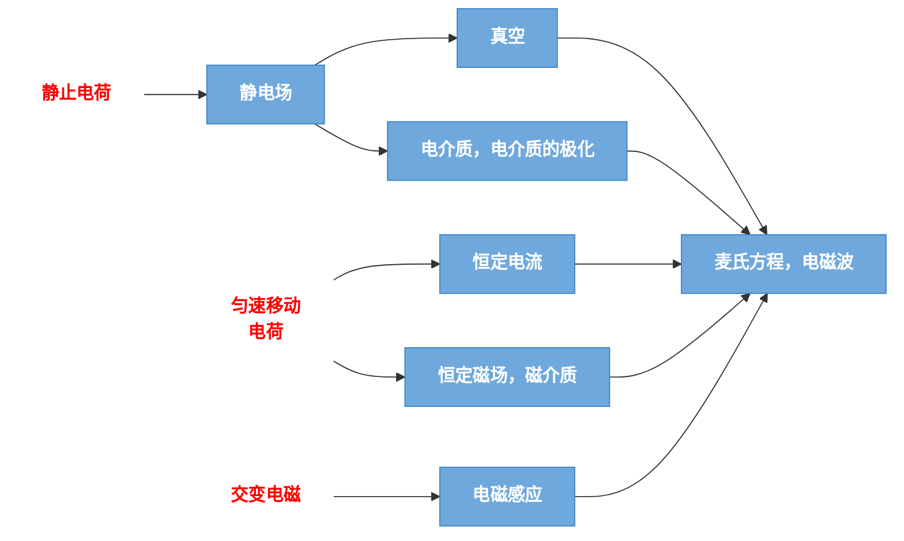

# 真空中的静电场

前面依旧一堆废话，直接从四个基本相互作用开始就可以了，然后开始考虑电磁学的内容和逻辑，下面是基本的思路图

## 电荷 库仑定律

### 电荷 电荷守恒定律

高中物理，正电荷和负电荷，然后同种电荷相互排斥，异种电荷相互吸引，根据物体的导电性能分为：导体、绝缘体、半导体

物体所带电荷的多少（正负电荷的代数和），简称电量，单位是库仑，然后密立根油滴实验说明了电荷量是量子化的，最小电荷量记为$e$，也称为元电荷：$e=1.6\times 10 ^{-19}$，你需要知道这是实验规律

带电方法主要是三种：摩擦起电、接触起点、感应起电全部都是通过将电荷从一个物体转移到另一个物体上的，因此我们有电荷守恒定律，在孤立的系统中，正负电荷的代数和在任何物理过程中保持不变

### 库仑定律 静电力叠加原理

!!! tip "库仑定律"
    所谓库仑定律就是一个简单的平方反比率带上量纲的形式，当然需要强调在真空中：

    $$
    \overline{F}_{12}= k \frac{q_{1}q_{2}}{r_{12}^{2}} \hat{r}_{12}
    $$

其中需要强调静电常数$k= \frac{1}{4\pi\varepsilon_{0}}$，并且$\varepsilon_{0}$是真空电容率或真空介电常数，其中数值为：

$$
\varepsilon_{0}=8.85 \times 10^{-12}C^{2} / (N\cdot m^{2})
$$

所谓静电力叠加原理就是静电力作用满足向量的加法

## 电场 电场强度

### 电场

动机是：静电力是如何相互作用的，作用方法一般认为是超距作用、近距作用，为了描述这种作用的传递，构建出场的概念，这是一种客观存在，物质的一种特殊形式，分布在整个空间

### 电场强度

关于场的定义，我们考虑一个试探电荷，其携带的电荷量足够小，并且放在电场中不会影响原有的电荷分布，然后将场强可以表示为：

$$
\overline{E}= \frac{\overline{F}}{\delta q}
$$

将公式组合在一起即可得到：点电荷的场强公式

$$
\overline{E}= \frac{\overline{F}}{\delta q}= \frac{1}{4\pi\varepsilon_{0}} \frac{q}{r^{2}} \hat{r}
$$

关于场强的叠加原理，依然是遵守向量运算的意思

那么如何求解带电体系的场强也是一个问题，通常的做法是将带电体进行微元（其中多个点电荷是显然的），那么在任意点处的场强：

$$
d \overline{E}= \frac{1}{4\pi\varepsilon_{0}} \frac{dq}{r^{2}} \hat{r}
$$

对于场源求积分，可以得到总场强：

$$
\overline{E} =\int d \overline{E} = \frac{1}{4\pi \varepsilon_{0}} \int \frac{dq}{r^{2}} \hat{r}
$$

!!! example "几个例子"
    + 关于电偶极子的系统，其中对于中垂线上距离中心较远一点的场强，与电矩成正比，与离中心的距离的三次方成反比，方向与电矩相反
    + 面上坐标轴某点的场强计算（近似）
    + 空间上带电圆环（圆盘）在坐标轴某点产生的场强

## 静电场的高斯定理

### 电场线

这是一个模型用于描述电场的分布，其中穿过的条数也就是电场线密度与面元的场强大小成正比

### 电场强度通量

穿过任一面元的电场线条数称为通过此面元的电场强度通量，定义为电场强度和面元矢量的标积

### 静电场的高斯定理

定主要需要掌握到高斯定理

!!! tip "高斯定理"
    电场中任意闭合曲面的电场强度通量，等于该曲面所包围的净电荷的$\frac{1}{\varepsilon_{0}}$，与曲面外的电荷无关$

    $$
    \Phi_{e}= \iint_{Surface} \overline{E} \cdot d \overline{S}= \frac{1}{\varepsilon_{0}} \sum\limits_{i}^{inside} q_{i}
    $$

注意：上述定义中的场强是该闭合曲面所处的空间的总场强，并非仅仅由于曲面的内部电荷所产生

证明方法是可以根据库仑定律和场强叠加原理，主要分为几个基本情况：

+ 简单情况：包围点电荷的同心球面
+ 一般情况：包围点电荷的任意闭合曲面，方法就是归一到球面（利用电场线的条数相同因此通量是不变的）
+ 不包围点电荷的任意闭合曲面
+ 多个点电荷——结合场强叠加原理

由此就可以得到高斯定理对于所有平方反比的有心力场都是适用的

这个证明其实是不重要的但是为了理解的更好还是稍微记下了Sketch,对于高斯定理的应用我们一般考虑对称性比较好的情况，选取合适的高斯面，这样就可以计算电荷系统的电场的分布了

!!! quote "一个总结"
    + 对称性分析
        + 球对称性
        + 轴对称性
        + 面对称性
    + 选择适当的高斯面
        + 高斯面必须通过要求的场强的场点
        + 高斯面上各点场强大小处处相等
        + 高斯面的形状尽量规则
    + 计算电通量和包围的电量的代数和
    + 计算各个部分，分别使用高斯定理（应该是不会考到的）

## 静电场的环路定理 电势

### 静电场力的保守性和环路定理

所谓保守力和非保守力（力学知识），就是做功是否只与初始点和终点，因为可以根据场强叠加原理得到矢量运算首尾相接很容易证明静电场力是保守的

所谓静电场的环路定理就是说，**在静电场中，场强沿着任意闭合路径的线积分是0**

证明方法是容易的，根据首尾相接然后静电力做功为0直接得到

### 电势和电势叠加原理

因为有了保守的观点，做功可以比较好的量化，所以定义电势能，假设无穷远处的电势能为0,那么我们可以得到某点的电势能为：

$$
W_{p}=q_{0}\int_{p}^{\infty}  \overline{E}  \, d \overline{l} 
$$

有了电势能我们再定义电势，公式定义为：

$$
U_{p}= \frac{W_{p}}{q_{0}}
$$

将两个单位正电荷的电势能之差定义为电势差（电压）

$$
U_{PQ}=\int_{P}^{Q}  \overline{E} \, d \overline{l} 
$$

电势叠加原理也是显然的，已知场强可以通过场强的线积分，或者利用点电荷的电势公式，通过叠加原理计算

$$
U(r)= \int \frac{dq}{4\pi\varepsilon_{0}r}
$$

### 等势面和电势梯度

所谓等势面就是说相同电势的点构成的面，显然的在等势面移动做功为0,并且等间隔的等势面密集处场强大，其他就是高中知识

有一些例子有点麻烦（关于点偶极子的一个带有倾角的情况）
