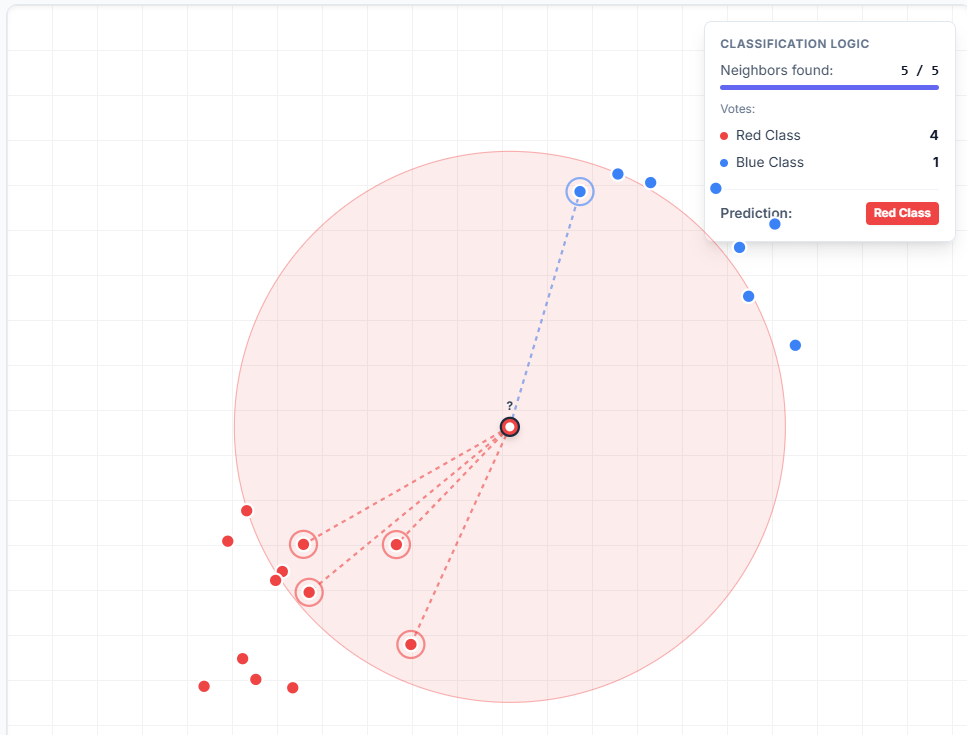

# Chapter 12 KNN

> [!tldr] Outline
> + KNN分类
> + KNN回归
> + 优缺点分析

所谓KNN就是K近邻法(K-nearest neighbor, KNN)是一种有监督的统计学习算法，利用对于距离的度量及选择合适的K值对数据进行分类或回归

## KNN分类

### Model Setting

假设响应变量$Y\in \left[ 1:J \right]$即有$J$类，$q_{j}$为第$j$类的先验概率，特征向量为$X=(X_{1},\dots,X_{p})^{T}$，假设$f_{j}(x)=\mathbb{P}(X=x|Y=j)$表示密度函数，然后根据Bayes方法，我们可以得到：

$$
\mathbb{P}(Y=j|X=x)= \frac{q_{j}f_{j}(x)}{\sum\limits_{i=1}^{J} q_{i}f_{i}(x)}=:p_{j}(x)
$$

其中$p_{j}(x)$为$X=x$的观测属于$j$的后验概率

**思路就是把一个给定的观测样本分类到估计的条件概率最大的类别中**

### 算法描述

给定训练的样本集$D=\left\{ (x_{i},y_{i}),i=1,\dots,n \right\}$和正整数$K$，计算每个样本点的特征向量$x_{i}$到测试特征向量$x_{0}$的距离，然后选取最近的K个样本点，记为$N_{0}$

计算条件概率估计为：

$$
\hat{p}_{j}= \frac{1}{K} \sum\limits_{x_{i}\in N_{0}}I(y_{i}=j)
$$

根据条件概率估计的大小进行分类，将观测值$x_{0}$分到概率$\hat{p}_{j}$最大的类中

显然K的选择是非常重要的，如果$K=1$称为最近邻算法，容易过拟合，而$K$取的过大则是容易欠拟合

> [!question] 如何选择最优的K
> + 方法：偏差、方差权衡，利用数据驱动的CV方法，绘制U型曲线，选择使得测试集上错误率最小的K
> + 选择合适的距离度量：欧氏距离、Manhattan距离、马氏距离
> + 调整距离占比权重

## KNN回归

仍然是原本的记号，增加一个假设数据来自下面的非参数回归模型

$$
y_{i}=g(x_{i})+\varepsilon_{i},i=1,\dots,n
$$

模型误差满足Gauss-Markov假设：$E(\varepsilon_{i})=0,Var(\varepsilon_{i})=\sigma^{2}<\infty$

算法步骤类似

将距离$x$最近的$K$个样本点集合记为$N_{K}(x)$，取平均：

$$
\hat{g}(x)= \frac{1}{K} \sum\limits_{x_{i}\in N_{K}(x)}y_{i}
$$

可以计算MSE：

$$
\begin{aligned}
\mathbb{E}(y_{0}- \hat{g}(x_{0}))^{2}&=\sigma^{2}+[Bias^{2}(\hat{g}(x_{0}))+Var(\hat{g}(x_{0}))]\\
&=\sigma^{2}+ \left[ g(x_{0})- \frac{1}{K}\sum\limits_{i=1}^{K}g(x_{(l)})  \right]^{2}+ \frac{\sigma^{2}}{K} 
\end{aligned}
$$

对于上面的MSE进行分析，即可知道，$K$小时偏差较小，但是方差变大，容易过拟合，$K$大周围样本点多，偏差大，方差小，容易欠拟合

进行方差，偏差权衡：

$$
\hat{K}_{opt}=arg\min_{K}MSE(\hat{g}(x_{0}))=arg \min_{K}[Bias^{2}(\hat{g}(x_{0}))+Var(\hat{g}(x_{0}))]
$$

## 优缺点分析

+ 优点
	+ 实现简单
	+ 对于非线性数据拟合好
	+ 非参数方法，无参数假设
	+ 稳健性好
	+ 预测效果好
+ 缺点
	+ K值的选取影响很大
	+ 计算成本高
	+ 维数灾难

下面是一个动态图示(可以玩一玩)：

<!-- 使用完整相对路径尝试渲染 -->
<iframe 
  src="../knn-visualization.html" 
  style="width: 100%; height: 800px; border: 1px solid #e5e7eb; border-radius: 0.5rem;" 
  scrolling="no"
  sandbox="allow-scripts allow-same-origin allow-popups allow-forms"
></iframe>

<!-- 注意：如果仍然无法渲染，可能是Markdown渲染器的安全限制或者React应用加载问题。
您也可以尝试直接在浏览器中打开knn-visualization.html文件进行查看。 -->

